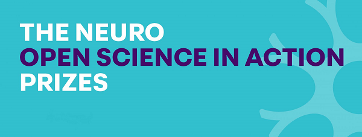

We are currently working on a range of projects aimed at addressing and overcoming fundamental hurdles in modern neuroscience. This often involves open-source tool/technique development that is directly driven by specific, open questions in neuroscience. We then use these novel tools in lab and in collaboration with other groups to investigate neurological function within the context of complex behavior. **Our research is open-source, highly collaborative and multi-disciplinary by nature.**

## Some research projects and areas of interest are outlined below
### Long-term continuous neuro-behavioral recording and processing platforms for naturally behaving animals
A major challenge in neuroscience is to uncover how defined neural circuits in the brain encode, store, modify, and retrieve information. Adding to this challenge is the fact that neural function does not operate in isolation from but rather within living, behaving animals. To tackle this challenge, significant advancement of neural, behavioral, and computational tools is needed along with new experimental approaches to enable the detailed study of neural circuits within the context of complex behavior and natural, ethologically relevant environments.

We aim to solve these challenges by developing a neuro-behavioral recording platform using a new generation of Miniscopes that are powered remotely and transmit data wirelessly. The increased optical sensitivity of these Miniscopes will allow for uninterrupted, long-term imaging of neural activity across a field-of-view 5 times the larger than other miniature microscopes currently available. Animals will live in natural environments where an array of behavioral devices, integrated through a central DAQ, tracks animal position/pose, extracts complex behavioral “syllables”, monitors events in the environment, and provides an interface for behavioral tasks. A computational framework is being developed to process the large stream of data in real-time. Processed data will be shared, as it is collected, through an open-access, timeseries database for further analysis.

### Long-term dynamics of CA1 pyramidal neurons
Using the above neuro-behavioral recording platform, we are working towards recording months-long, continuous neural activity across thousands of neurons while animals engage in complex behaviors across naturalistic environments. Data collected here will allow us and others to investigate neural activity at unprecedented scales and within the context of complex, unconstrained behavior. We believe this approach will shed light into the spaces between what traditional approaches have given us so far: producing lifelong “movies”, rather than individual “snapshots”, of neural dynamics and behavior across time, space, and task and allow us to ask "what does the lifetime of a place cell look like".

### SpatioTemporal Illumination Miniscope (STIMscope)
Great technological advances over the past decades have allowed researchers to begin to optically measure and modulate neural activity but these approaches are often limited to head-fix animals when studying neural function at spatial and temporal scales relevant to internal neural circuit dynamics. While a great deal of scientific and technological progress has been made, there is still much to learn concerning complex neural function, especially within the context of natural behavior. This gap in knowledge, at least in part, is due to a lack of accessible tools for simultaneously modulating and observing large-scale neural circuits with single cell precision in freely behaving animals. This project will fill this gap by developing open-source, head-mounted miniature microscopes with spatiotemporal illumination capabilities for both patterned photo-stimulation and improved neural imaging in freely behaving animals. To maximize the impact of our efforts, all tools and technologies developed for this project will be open-source and shared widely with the scientific community through online resources and technical workshops.

### Place cell dynamics across techniques and animal species
As neural imaging techniques in freely behaving animals advance, there are still open questions as to the source of place cell property differences across imaging and electrophysiological techniques in different animal species. Using an array of Miniscope and ephsy devices, we are working towards uncovering these differences and their sources. 

### Hippocampal dynamics during social interaction 

### Additional new generations of minature microscopes
Supported by the BRAIN Initiative and in collaboration with Dr. Michele Basso and Dr. Peyman Golshani, we are developing Miniscopes specifically for larger animal models such as rats, rhesus macaque monkeys, and marmosets. With the relaxed size and weight constrains that come with larger animal models, we are expanding the FOV to 30 times that of the standard Miniscope and incorporating optional wire-free data acquisition.

Additional tools under development are:
* Large FOV Miniscope for mice
* Dual excitation Miniscope for multi-channel imaging and single channel imaging plus optogenetic stimulation
* Electrophysiology integrated Miniscopes
* Wireless Miniscopes

### Integrating neural and behavior recording
* [Next Gen Miniscopes](https://github.com/Aharoni-Lab/Miniscope-v4)
* [Miniscope DAQ Software](https://github.com/Aharoni-Lab/Miniscope-DAQ-QT-Software)
* [MiniCAM](https://github.com/Aharoni-Lab/MiniCAM)

### NSF NeuroNex Hub
Supported by our NSF NeuroNex Technology Hub, we are developing new Miniscopes that integrate electrophysiology recording in parallel with imaging. We currently are able to recording 32 electrode channels (with Tetrodes and/or Silicon probes) in conjunction with calcium imaging and are working on systems capable of reaching upwards of 192 electrode channels. As part of this project we are also designing a module capable of light-field microscopy and hardware for real-time processing of imaging data to drive optogenetic, electrical, and behavioral feedback.

  
   
  

