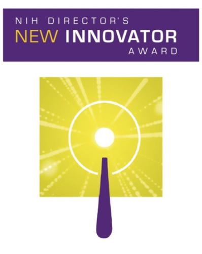
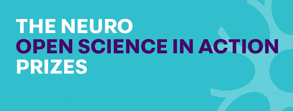

We develop open-source tools that are directly driven by open questions in neuroscience, and then use those tools, in the lab and with collaborators, to study neural circuits in the context of natural, unconstrained behavior. Our research is **open source, highly collaborative, and multi-disciplinary by nature**, spanning optics, electronics, firmware, software, data analysis, and systems neuroscience.

## The UCLA Miniscope Project

The [UCLA Miniscope Project](https://miniscope.org) is an open-source ecosystem for cellular-resolution fluorescence imaging in freely behaving animals: head-mounted microscopes, data acquisition hardware and software, analysis pipelines, and the documentation and training that hold a community together. Since the first open-source Miniscope, the platform has been adopted by more than 1,000 laboratories in 18+ countries and has contributed to more than 200 peer-reviewed publications ([see Impact](/Impact/)).

Through an NIH BRAIN Initiative U24 resource award (2025–2030, with Peyman Golshani), we are now rebuilding the foundations of that ecosystem so it can be sustained and extended by the community: integrated documentation and guides on [miniscope.org](https://miniscope.org), continuous integration and hardware-in-the-loop testing, modular firmware and software architectures, a Scientific Steering Group, and training at every level, from bi-weekly drop-in office hours to multi-day domestic and international workshops.

Related open-source software from the lab and the Miniscope organization includes [Minian](https://github.com/miniscope/minian) (calcium imaging analysis), [CaLab](https://github.com/miniscope/CaLab) (browser-based spike deconvolution: CaTune and CaDecon), [miniscope-io](https://github.com/Aharoni-Lab/miniscope-io) (acquisition and I/O), and [Labki](https://github.com/labki-org), the semantic-wiki framework behind miniscope.org.

## Next-generation miniature microscopes

**Wireless and wire-free Miniscopes.** Tethers constrain behavior and limit experiments to single animals in simple arenas. We have developed wire-free Miniscopes that record to onboard storage, and are building fully wireless systems in which both power and data are delivered without cables. This enables uninterrupted recording from naturally behaving animals in complex environments and in groups ([Aharoni, Brosch & Sasatani, SPIE 2026](/Publications/)).

**Large field-of-view and multi-region imaging.** [Miniscope-LFOV](https://doi.org/10.1126/sciadv.adg3918) brought single-cell resolution across a field of view many times larger than standard Miniscopes, in mice, rats, and non-human primates. [MiniXL](https://doi.org/10.1126/sciadv.ads4995) extends this to simultaneous imaging of multiple brain regions in mice, and a [dual-channel Miniscope](https://doi.org/10.1126/sciadv.adr6470) enables two-color imaging of distinct populations or indicators.

**Miniature two-photon microscopy.** With the Golshani lab, we developed [open-source miniature 2-photon systems](https://doi.org/10.1038/s41467-025-62534-y) that bring optical sectioning and deeper imaging to freely behaving animals.

**Patterned illumination and all-optical interrogation.** [STIMscope](https://doi.org/10.64898/2026.05.27.728160) is an open-source, real-time platform for centimeter-scale imaging combined with patterned optogenetic stimulation at single-cell resolution, built around a GPU-accelerated closed-loop pipeline. We are extending the same spatiotemporal-illumination approach to head-mounted Miniscopes (MiniSTIM), for simultaneous imaging and targeted manipulation of neural circuits in freely behaving animals, and to next-generation standard Miniscopes that use patterned excitation to reduce photobleaching during long recordings.

## Real-time and long-term recording

A central goal of the lab is to move from *snapshots* of neural activity to *movies* that span weeks to months. That requires hardware that can run continuously, and analysis that keeps up with the data. We build [hardware for real-time decoding of calcium imaging](https://doi.org/10.7554/eLife.78344) and streaming analysis frameworks that process imaging data frame-by-frame, so that arbitrarily long recordings can be analyzed on modest computers and used to drive closed-loop experiments. Together with wireless Miniscopes and integrated behavioral tracking, these form a neuro-behavioral recording platform for naturalistic environments.

## Neural circuits in naturalistic behavior

We use these tools to ask how hippocampal and cortical circuits encode and update information over long timescales and during complex behavior:

* **Memory and spatial coding.** How place cells [remap with memory storage of aversive experiences](https://doi.org/10.7554/eLife.80661), how [spatial coding breaks down in epilepsy](https://doi.org/10.1038/s41593-019-0559-0), and how [shared neural ensembles link memories](https://doi.org/10.1038/nature17955) encoded close in time.
* **Social behavior.** [Correlated signatures of social behavior](https://doi.org/10.7554/eLife.88439.3) in cerebellum and anterior cingulate cortex, and how social representations evolve in striatal circuits.
* **Lifetime of a place cell.** Months-long, continuous imaging of thousands of neurons while animals live in enriched, naturalistic environments — what does the life of a place cell look like?

## Funding

Our work is supported by the National Institutes of Health, including the NIH Director's New Innovator Award (DP2 MH129986), the BRAIN Initiative (U24 NS144101, U01 NS126050, U01 NS128664, R01 NS147959), and NIMH (R01 MH131858, R01 MH137527, RM1 MH132651); by the W. M. Keck Foundation, the Chan Zuckerberg Initiative, the Eleanor Leslie Chair in Innovative Brain Research, and previously the NSF NeuroNex program and the Neuro Open Science in Action Prize.

  
  
  
  

